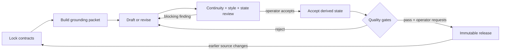

# Weaver’s executable loop

The machine-readable source is [`loop.manifest.json`](../loop.manifest.json).
This page is the human view of the same contract.



## Authority boundary

Models may propose prose, state updates, and review findings. They cannot accept
derived state, overwrite a content-addressed release, or publish anything.
`state:accept` and `release` are explicit caller-controlled transitions.

## Gates that are proven able to fail

| Gate | Known-good path | Known-bad fixture |
| --- | --- | --- |
| Downstream state | Current source and upstream hashes pass | Editing scene 1 invalidates scene 1 and every downstream record |
| Repetition | Distinct sentences pass | A cross-scene near-copy is detected |
| Immutable release | A new ID builds | Reusing an ID after a manuscript edit throws |
| Reader assembly | Prose becomes the reader | Scene metadata is excluded |

Run all release evidence with:

```bash
npm run preflight
```

The final clean-consumer test installs the packed tarball, not the source
directory. This catches missing templates, exports, executable metadata, and
other failures hidden by a working checkout.
